# Kettle Linux

A SteamOS-like Linux distro for the **AYN Odin 2 Portal** and the **AYN Thor** (Snapdragon 8 Gen 2,
SM8550/QCS8550), and the **Retroid Pocket 5** (Snapdragon 865, SM8250).

Kettle combines a patched mainline kernel with the aarch64 userspace from Valve's SteamOS
"deckard" (Steam Frame). You get Valve's arm64 Steam client, a handheld Game Mode and a
Plasma desktop. Updates work like SteamOS: signed, atomic A/B images installed from Steam's
own *Check for updates*.

> **Status:** early and in active development. Kettle boots on hardware with working display,
> audio, Wi-Fi, controls, Game Mode and Desktop Mode. Several features are built but not yet
> tested on a Portal. See [Project Status](https://github.com/kettlelinux/kettlelinux/wiki/Project-Status).
>
> **AYN Thor** (same SoC, two screens): public test builds. See [docs/THOR.md](docs/THOR.md)
> for what has been tested on it.
>
> **Retroid Pocket 5** (Snapdragon 865): first public test build, 20261001.5. See
> [docs/RP5.md](docs/RP5.md) for what has been tested, and [docs/INSTALL-RP5.md](docs/INSTALL-RP5.md)
> to install it. Each device gets its own image and its own updates;
> [docs/PORTING.md](docs/PORTING.md) has how devices are kept apart and how to add one.

**Documentation lives in the [wiki](https://github.com/kettlelinux/kettlelinux/wiki).**

## A look around Game Mode

Kettle's own tools are in Steam's Quick Access menu (**…**, then the plug icon). A new device
opens the same tour in Welcome. These are from an Odin 2 Portal.

| Game Settings | | | |
|:-:|:-:|:-:|:-:|
| 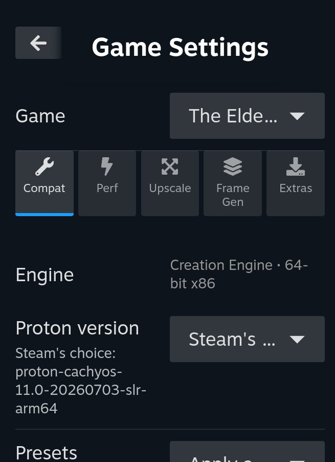 | 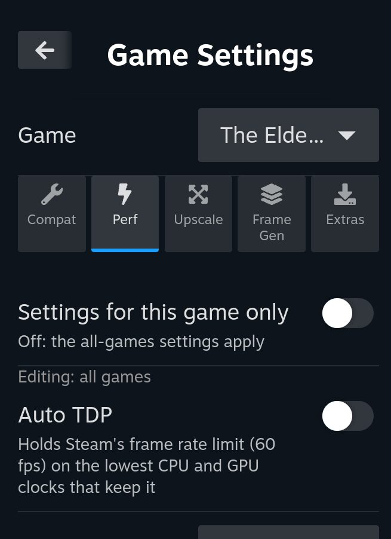 | 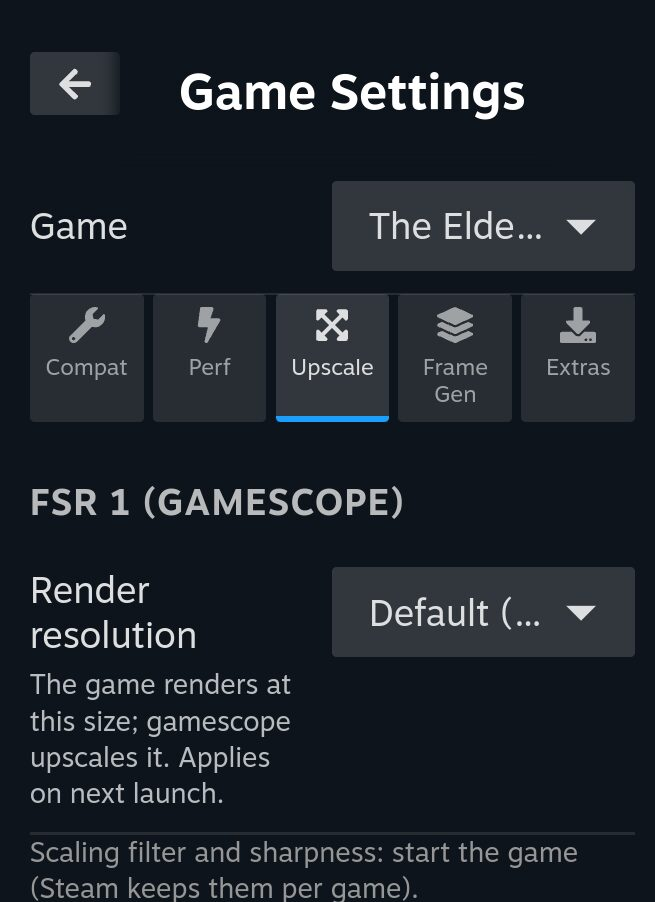 | 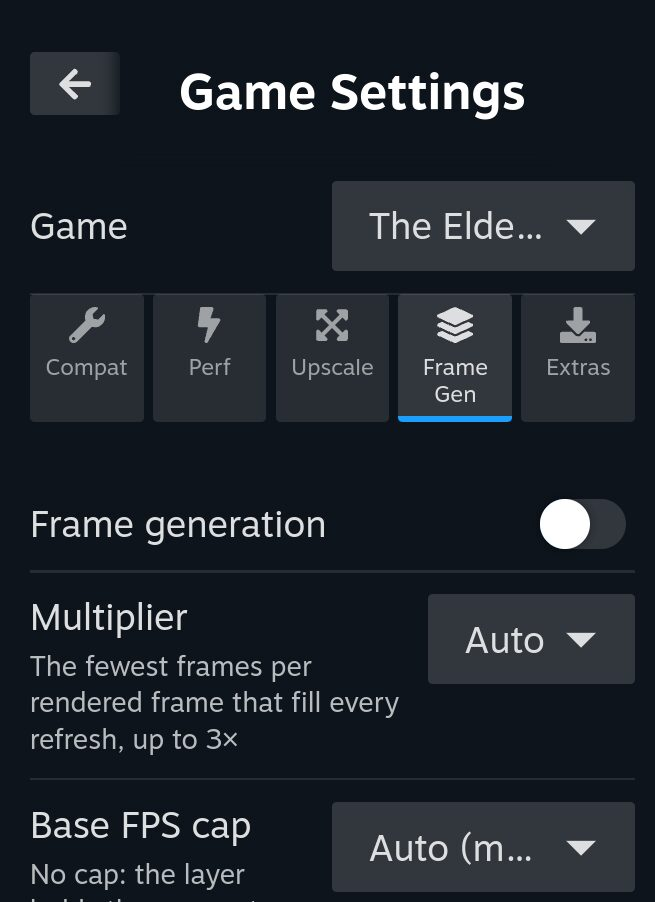 |
| **Compat**: Proton, FEX, DXVK, vkd3d and Turnip options, known good settings | **Perf**: fan, CPU limits, refresh rate, Auto TDP | **Upscale**: FSR 1, and SGSR 2 / Arm ASR / FSR 2.2 through OptiScaler | **Frame Gen**: Kettle's own frame generation |

| Device Settings | | | | | Quick Access |
|:-:|:-:|:-:|:-:|:-:|:-:|
| 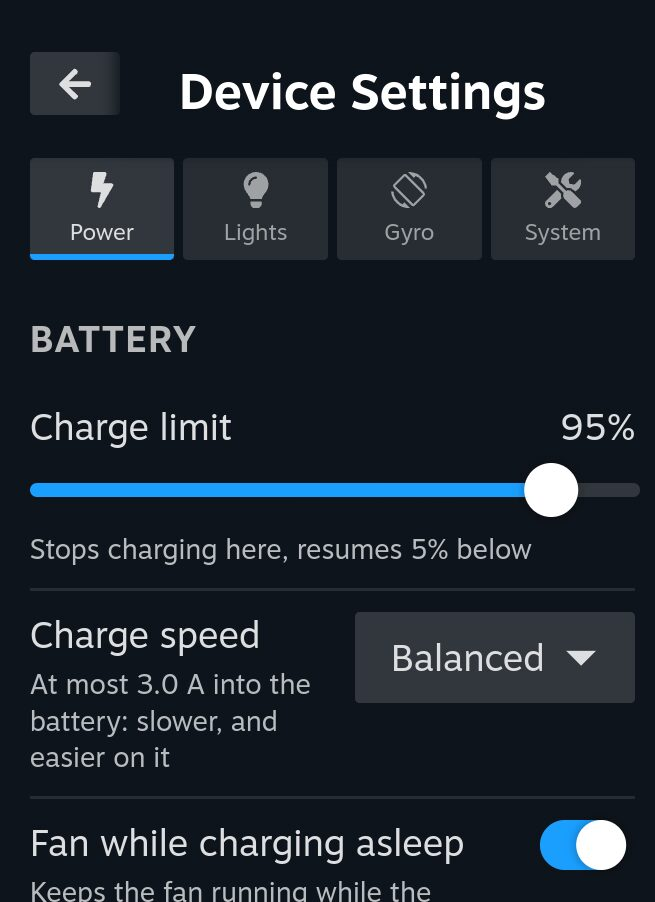 | 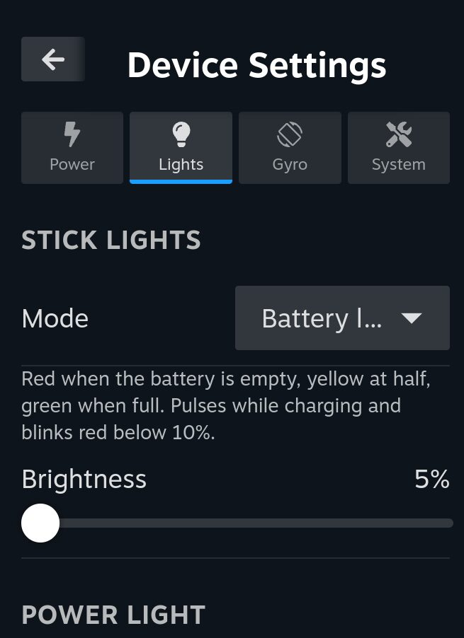 | 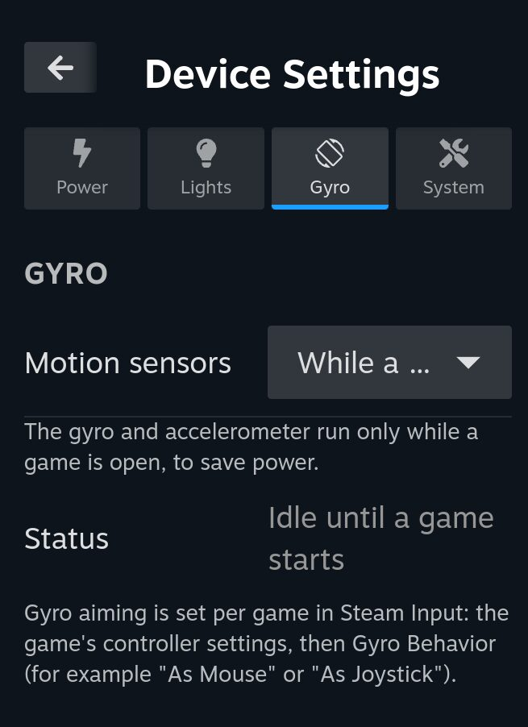 | 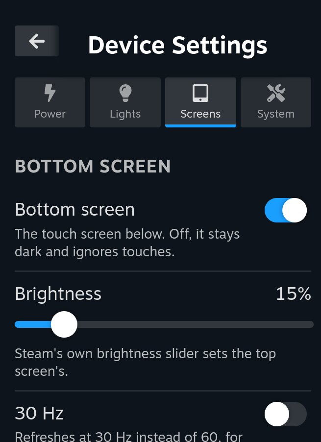 | 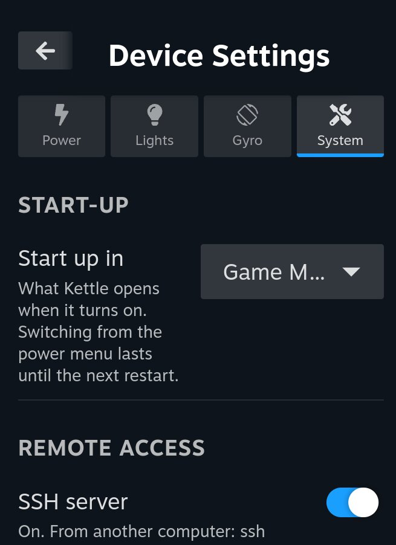 | 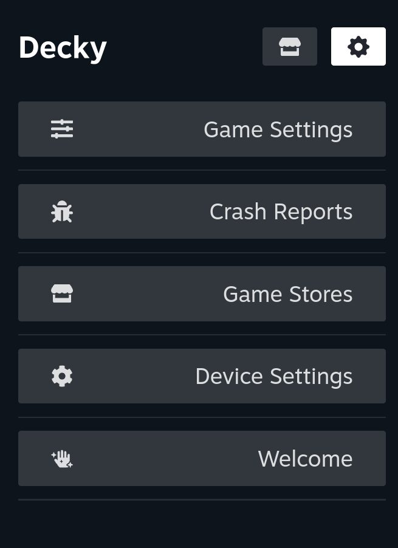 |
| **Power**: charge limit and speed, refresh rate | **Lights**: the stick lights, and the Portal's power light | **Gyro**: motion controls | **Screens**: the Thor's bottom screen | **System**: start-up mode, SSH, reset, bootloader updates | Game Settings, Crash Reports, Game Stores, Device Settings, Welcome |

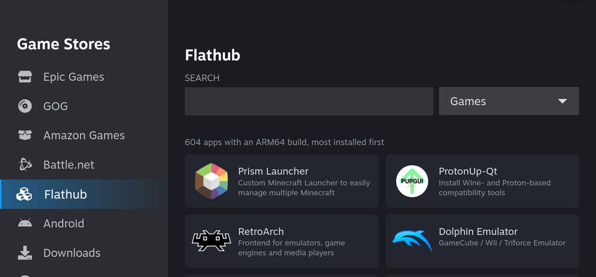

*Game Stores: Epic Games, GOG, Amazon Games, Battle.net, Flathub's ARM64 apps and Android games.*

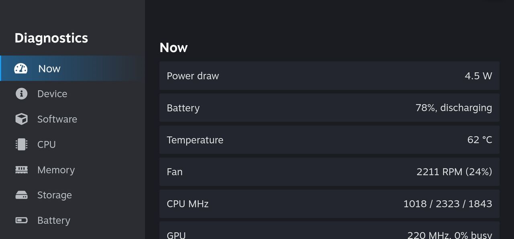

*Diagnostics, from Device Settings: power draw, temperatures, clocks and everything about the device.*

## Features

- **Mainline kernel**: Linux 7.2 with a pinned patch stack for the panels, gamepad, LEDs,
  haptics, microSD, Wi-Fi and s2idle suspend.
- **SteamOS experience**: Valve's arm64 Steam client with its own handheld Game Mode
  (gamescope), steamos-manager, and switching between Game Mode and Desktop.
- **Atomic A/B updates**: Valve's SteamOS update stack (steamcl, RAUC, atomupd) built for arm64,
  with a read-only root and automatic fallback if an update fails to boot.
  ([docs/UPDATES.md](docs/UPDATES.md))
- **Install to internal storage** next to Android with the Kettle Installer, including backup
  and restore. ([docs/INTERNAL-INSTALL.md](docs/INTERNAL-INSTALL.md))
- **Controller support**: InputPlumber presents the built-in pad to Steam as a Steam Deck
  controller. In Desktop Mode the gamepad works as mouse and keyboard, with an on-screen keyboard.
- **The desktop in Game Mode**: Desktop in Steam's library opens the Plasma desktop inside Game
  Mode, without a session switch, with the desktop's controls. ([docs/NESTED-DESKTOP.md](docs/NESTED-DESKTOP.md))
- **Game Mode plugins** (Decky Loader), in Quick Access:
  - **Game Settings**: everything set per game, a tab each, all off until enabled for a game.
    **Compat**: FEX, DXVK, vkd3d, Turnip and Proton options, the Proton version, and known good
    settings from the Kettle game database ([docs/GAME-DATABASE.md](docs/GAME-DATABASE.md)).
    **Perf**: fan curve, CPU core and clock limits, Auto TDP and the refresh rate, per game or
    for all games. **Upscale**: gamescope FSR 1, and SGSR 2, Arm ASR or FSR 2.2 through an ARM64EC
    build of OptiScaler. **Frame Gen**: Kettle's own Vulkan layer, 2×, 3× or an automatic
    multiplier, with automatic frame rate capping. **Extras**: GE-Proton, Proton-CachyOS and AMD
    FSR 3.1, downloaded from their projects.
  - **Game Stores**: see below.
  - **Device Settings**: the device's own settings, a tab each. **Power**: charge limit and speed,
    and the refresh rate. **Lights**: the RGB rings around the sticks (a color, the battery level,
    breathe or rainbow) and the Portal's power button light. **Gyro**: the motion sensors for
    Steam Input. **Screens**: the Thor's bottom screen. **System**: the start-up mode, the SSH
    server and resetting the device. And a **Diagnostics** window with everything about the device.
  - **Crash Reports**: see below.
  - **Welcome**: a tour of all of this, with screenshots, on first boot.
- **Power control**: TDP budget, performance profiles and GPU clock from Steam's Performance panel,
  per-game fan curves, CPU limits and Auto TDP from Game Settings, or a Desktop Mode tray applet; a
  battery charge limit and charge speed from Device Settings; and the refresh rate: Auto, where Steam's frame limit picks a
  rate it divides evenly, or held at 60 or 120 Hz on the Thor and 50, 60, 100, 120, 145 or 165 Hz
  on the Portal.
- **Games outside Steam**: ARM64EC Wine with FEX, DXVK and vkd3d-proton, plus Lutris and Heroic
  built for arm64.
- **Game Stores in Game Mode**: signs in to Epic Games, GOG and Amazon Games, lists your games,
  installs and updates them, and adds them to your Steam library to play with Proton. Sign-ins and
  installs are shared with Heroic on the desktop. It also adds Battle.net, installs Flathub's ARM64
  apps by category (emulators and streaming apps among them), and Android games from F-Droid or an
  APK file. ([docs/GAME-STORES.md](docs/GAME-STORES.md))
- **Native ARM64 games**: the Linux builds of FNA, XNA, MonoGame and .NET games (Terraria,
  Stardew Valley) run their own code on ARM64 instead of under FEX, from Game Settings.
  ([docs/NATIVE-GAMES.md](docs/NATIVE-GAMES.md))
- **Community Proton builds**: GE-Proton and Proton-CachyOS (their ARM64 releases), installed
  and updated from Game Settings' Extras tab or the desktop's Kettle Welcome.
- **Battle.net**: Game Stores (or the desktop's Kettle Welcome) adds Blizzard's launcher to Steam,
  set up to run with Proton-CachyOS.
- **Android games**: add an Android game to Steam and play it in Game Mode, through Lepton, the
  Android layer Valve made for the Steam Frame (APK files, F-Droid, or opt-in Google Play).
- **Hardware video in Firefox**: H.264, HEVC, VP9 and AV1 on the SoC's video decoder, YouTube
  included.
- **Two screens on the Thor**: Steam on the top screen, and in Game Mode the Performance app and
  a touch shell of its own (Plasma Mobile) on the bottom one; both screens in the desktop.
- **Crash reports**: a report for every game or system crash, in Quick Access > Crash Reports.
  Sharing one uploads it with the player's details taken out on the device, and gives a link to
  file it on GitHub ([docs/CRASH-REPORTS.md](docs/CRASH-REPORTS.md)).
- **microSD libraries**: a card put in is mounted and added to Steam as a library, as on a Steam
  Deck.
- **Desktop welcome hub**: setup shortcuts, controls help, and one-click *Gaming Extras*
  (emulators, streaming and tools) from Flathub, and GE-Proton and Proton-CachyOS for Steam from
  their ARM64 releases.
- **Kettle branding**: boot splash, Steam startup movie and Plasma splash, all rendered from source art.

## Getting started

- **Download:** [kettlelinux.org](https://kettlelinux.org)
- **Community:** [Discord](https://discord.gg/uKGartjFha) for help, test builds and release news
- **Installing:** [docs/INSTALL.md](docs/INSTALL.md)
- **Testing your own builds:** [docs/TESTING.md](docs/TESTING.md)
- **Building from source:** [Building](https://github.com/kettlelinux/kettlelinux/wiki/Building)
  (x86_64 Linux host, no root needed)
- **Adding a device:** [docs/PORTING.md](docs/PORTING.md)
- **Repository layout:** [Repository Layout](https://github.com/kettlelinux/kettlelinux/wiki/Repository-Layout)

## Disclaimer

Kettle Linux is provided **as is, without warranty of any kind**, and you use it at your own risk.
Installing it changes how your device starts up and can erase data, affect the manufacturer's
warranty, or leave a device that doesn't start until it's restored; its power, fan and charging
settings act on the hardware. The project and its contributors aren't liable for any damage or
loss from using it (see the [LICENSE](LICENSE) and the
[full disclaimer](https://kettlelinux.org/legal.html#disclaimer)). Kettle Linux is not affiliated
with Valve, AYN, Retroid or any other company named here; their names and trademarks belong to
them.

## Thanks

Kettle Linux is built on the work of many projects and people. Thank you all.

**Device support and kernel**
- [ROCKNIX](https://github.com/ROCKNIX): SM8550 kernel patches, the Odin 2 device trees,
  [extra firmware](https://github.com/ROCKNIX/extra-firmware) and the [ABL](https://github.com/ROCKNIX/abl)
- Teguh Sobirin: the Odin 2 family and Thor device trees
- [AYN](https://github.com/AYNTechnologies): [U-Boot for SM8550](https://github.com/AYNTechnologies/u-boot), shipped on the Portal and Thor and on Kettle's card
- Luke Johnson (ROCKNIX): the Thor's ALSA UCM profile
- [pocknix-os](https://github.com/shuuri-labs/pocknix-os): suspend, UFS and SD patches
- Aaron Kling: the upstream "Support AYN QCS8550 Devices" series
- Manivannan Sadhasivam (via NovaDeck), Armada and Thorch: kernel fixes carried in our patch stack
- [The Linux kernel](https://kernel.org) and [linux-firmware](https://git.kernel.org/pub/scm/linux/kernel/git/firmware/linux-firmware.git)

**SteamOS and the base system**
- [Valve](https://store.steampowered.com/steamos): SteamOS, the deckard userspace,
  [steamos-efi](https://gitlab.steamos.cloud/holo/steamos-efi),
  [steamos-customizations](https://gitlab.steamos.cloud/holo/steamos-customizations),
  [gamescope](https://github.com/ValveSoftware/gamescope) and Proton ARM64
- [RAUC](https://rauc.io) and [desync](https://github.com/folbricht/desync): update bundles and chunk stores
- [KDE Plasma](https://kde.org/plasma-desktop/), [plasma-keyboard](https://invent.kde.org/plasma/plasma-keyboard)
  and [KScreen](https://invent.kde.org/plasma/kscreen)
- [Plymouth](https://www.freedesktop.org/wiki/Software/Plymouth/)
- [Mesa](https://mesa3d.org) (turnip, the Adreno Vulkan driver)

**Controls, overlays and plugins**
- [InputPlumber](https://github.com/ShadowBlip/InputPlumber) by ShadowBlip
- [MangoHud](https://github.com/flightlessmango/MangoHud)
- [Decky Loader](https://github.com/SteamDeckHomebrew/decky-loader) by SteamDeckHomebrew
- [Sloptiscaler](https://github.com/justradical/Sloptiscaler), a fork of [OptiScaler](https://github.com/optiscaler/OptiScaler)
- [Snapdragon GSR](https://github.com/SnapdragonStudios/snapdragon-gsr) (Qualcomm),
  [Arm ASR](https://github.com/arm/accuracy-super-resolution-generic-library) and
  [AMD FidelityFX FSR 2](https://github.com/GPUOpen-Effects/FidelityFX-FSR2)
- [DirectXShaderCompiler](https://github.com/microsoft/DirectXShaderCompiler) and
  [llvm-mingw](https://github.com/mstorsjo/llvm-mingw)

**Running Windows games**
- [Hangover](https://github.com/AndreRH/hangover) and [Wine](https://www.winehq.org)
- [FEX-Emu](https://github.com/FEX-Emu/FEX)
- [DXVK](https://github.com/doitsujin/dxvk) and [vkd3d-proton](https://github.com/HansKristian-Work/vkd3d-proton)
- [Lutris](https://lutris.net), [Winetricks](https://github.com/Winetricks/winetricks) and
  [cabextract](https://www.cabextract.org.uk/)
- [Heroic Games Launcher](https://heroicgameslauncher.com) with
  [legendary](https://github.com/legendary-gl/legendary),
  [gogdl](https://github.com/Heroic-Games-Launcher/heroic-gogdl) and
  [nile](https://github.com/imLinguin/nile)

The provenance of every kernel patch is in [kernel/patches/README.md](kernel/patches/README.md),
and each PKGBUILD in [packages/](packages/) links its upstream.

## License
Kettle Linux's own work (the build scripts, device overlays, `kettle-*` packages and docs) is
under the BSD 3-Clause License, in [LICENSE](LICENSE). Everything built from other projects keeps
its upstream license: the patches in `kernel/patches/` and `packages/*/` are under the license
of the project they patch (the kernel's GPL-2.0-only, Valve's SteamOS packages' GPL-2.0+ and
LGPL-2.1+, and so on), and each PKGBUILD's `license=` says what the package it builds is under.
